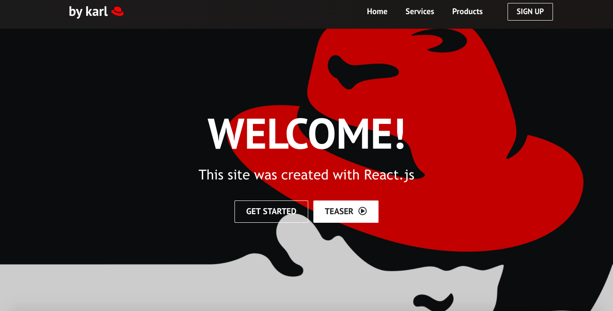

# Read Me

---

### Table of Contents

- [Description](#description)
- [How To Use](#how-to-use)
- [License](#license)
- [Author Info](#author-info)

---

## Description

- This is a random website made with React.js so I could improve my skill with React.js
- The back-end is currently missing, therefore it's a static webpage without any proper back-end functionality.
- The logos and pictures used in the website don't belong to me and I don't claim any ownership over them.

#### Technologies

- React.js
- CSS

[Back To The Top](#read-me-template)

---

## How To Use

#### Installation

- Clone the repository -> Go inside the repository, open console and run 'npm i'
- Run 'npm start' inside the repository.

[Back To The Top](#read-me-template)

---

## Author Info

- Twitter - [@jaaskakarl](https://twitter.com/jaaskakarl)
- LinkedIn - [Karl Marten J.](https://linkedin.com/in/karl-marten-jaaska-0646251b3)
- GitHub - [jaaska-dev](https://github.com/jaaska-dev)

[Back To The Top](#read-me-template)
